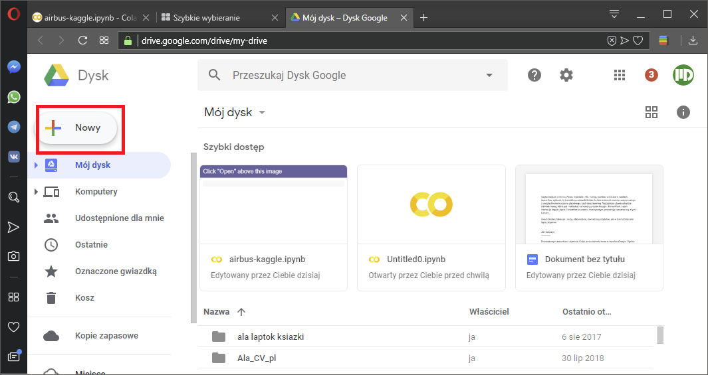
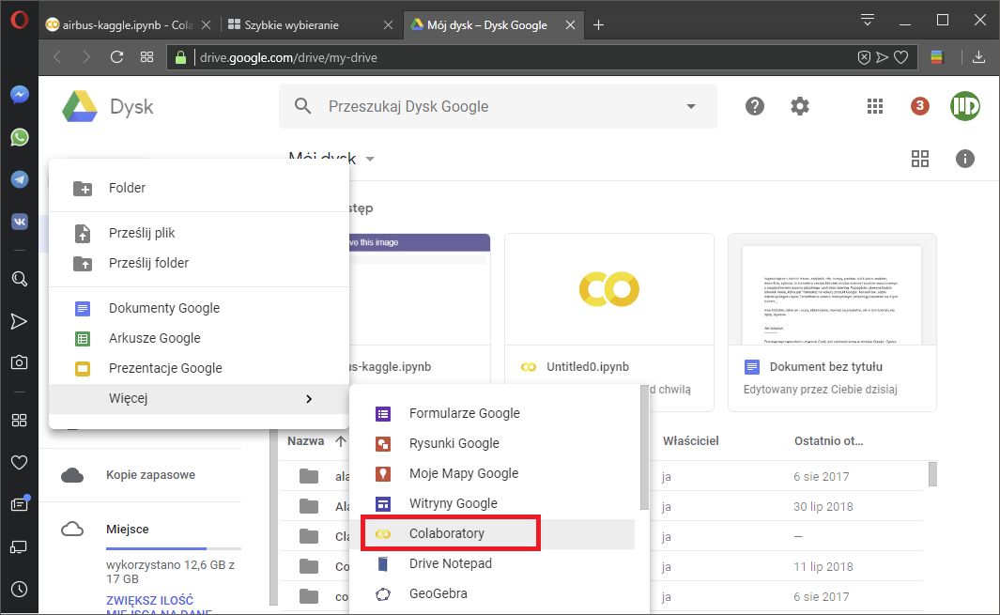
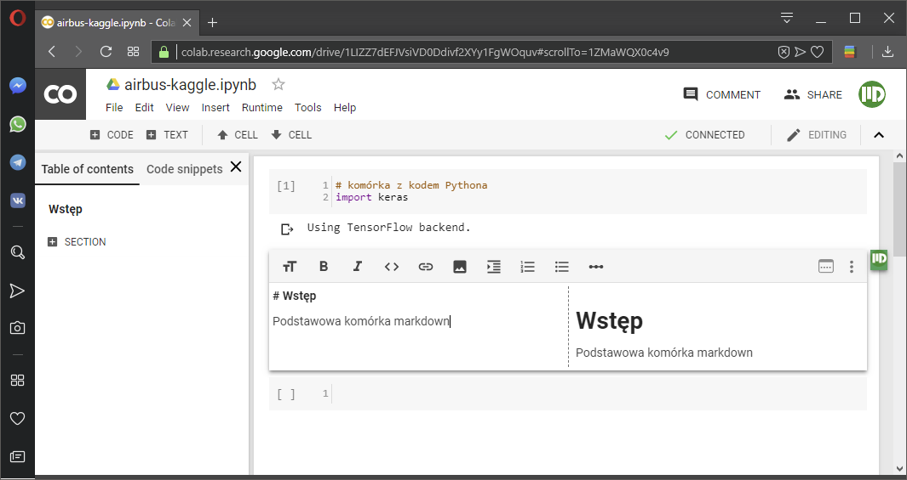
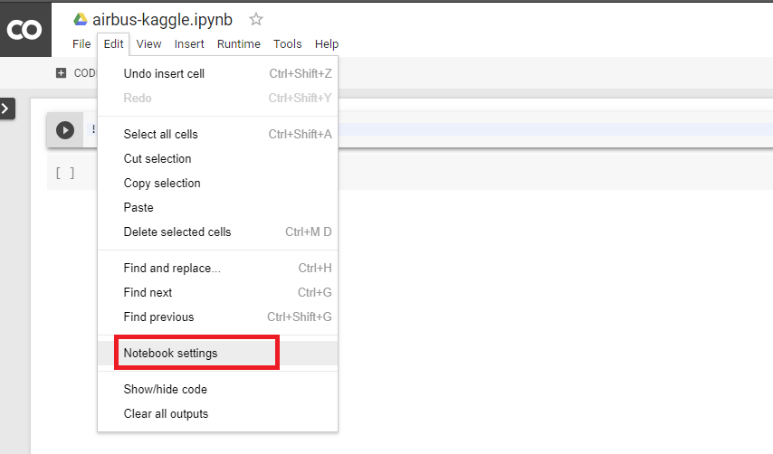
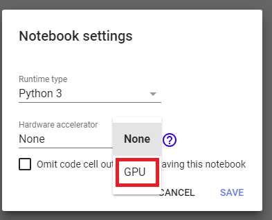

.. colab:

Google Colab
============

Dokument opisuje pokrótce jak podłączyć i używać produktu Google zwanego colab, które jest po prostu notatnikiem ipythona (ipython notebook) z warstwą współdzielenia podobną do Google Docs i opierającym się na autentykacji via konto google. Pliki zapisywane są na naszym koncie w Google Drive. Niewątpliwą zaletą Colab jest udostępnianie za darmo całej przestrzeni dyskowej przypisanej do danego konta Google (około 15-17 GB) i udostępnianie pojedynczej jednostki GPU do obliczeń. Colab posiada też znaczą ilość preinstalowanych bibliotek pythona nakierowanych na machine learning (listing z 08.08.2018):

.. code-block:: bash
    
    !pip list

    Package                  Version  
    ------------------------ ---------
    absl-py                  0.3.0    
    altair                   2.1.0    
    astor                    0.7.1    
    beautifulsoup4           4.6.1    
    bleach                   2.1.3    
    cachetools               2.1.0    
    certifi                  2018.4.16
    chardet                  3.0.4    
    crcmod                   1.7      
    cycler                   0.10.0   
    decorator                4.3.0    
    entrypoints              0.2.3    
    future                   0.16.0   
    gast                     0.2.0    
    google-api-core          1.3.0    
    google-api-python-client 1.6.7    
    google-auth              1.4.2    
    google-auth-httplib2     0.0.3    
    google-auth-oauthlib     0.2.0    
    google-cloud-bigquery    1.1.0    
    google-cloud-core        0.28.1   
    google-cloud-language    1.0.2    
    google-cloud-storage     1.8.0    
    google-cloud-translate   1.3.1    
    google-colab             0.0.1a1  
    google-resumable-media   0.3.1    
    googleapis-common-protos 1.5.3    
    grpcio                   1.14.0   
    h5py                     2.8.0    
    html5lib                 1.0.1    
    httplib2                 0.11.3   
    idna                     2.6      
    ipykernel                4.6.1    
    ipython                  5.5.0    
    ipython-genutils         0.2.0    
    Jinja2                   2.10     
    jsonschema               2.6.0    
    jupyter-client           5.2.3    
    jupyter-core             4.4.0    
    Keras                    2.1.6    
    Markdown                 2.6.11   
    MarkupSafe               1.0      
    matplotlib               2.1.2    
    mistune                  0.8.3    
    mpmath                   1.0.0    
    nbconvert                5.3.1    
    nbformat                 4.4.0    
    networkx                 2.1      
    nltk                     3.2.5    
    notebook                 5.2.2    
    numpy                    1.14.5   
    oauth2client             4.1.2    
    oauthlib                 2.1.0    
    olefile                  0.45.1   
    opencv-python            3.4.2.17 
    packaging                17.1     
    pandas                   0.22.0   
    pandas-gbq               0.4.1    
    pandocfilters            1.4.2    
    patsy                    0.5.0    
    pexpect                  4.6.0    
    pickleshare              0.7.4    
    Pillow                   4.0.0    
    pip                      18.0     
    plotly                   1.12.12  
    pluggy                   0.7.1    
    portpicker               1.2.0    
    prompt-toolkit           1.0.15   
    protobuf                 3.6.0    
    psutil                   5.4.6    
    ptyprocess               0.6.0    
    py                       1.5.4    
    pyasn1                   0.4.4    
    pyasn1-modules           0.2.2    
    Pygments                 2.1.3    
    pyparsing                2.2.0    
    pystache                 0.5.4    
    python-dateutil          2.5.3    
    pytz                     2018.5   
    PyWavelets               0.5.2    
    PyYAML                   3.13     
    pyzmq                    16.0.4   
    requests                 2.18.4   
    requests-oauthlib        1.0.0    
    rsa                      3.4.2    
    scikit-image             0.13.1   
    scikit-learn             0.19.2   
    scipy                    0.19.1   
    seaborn                  0.7.1    
    setuptools               39.1.0   
    simplegeneric            0.8.1    
    six                      1.11.0   
    statsmodels              0.8.0    
    sympy                    1.1.1    
    tensorboard              1.9.0    
    tensorflow               1.9.0    
    tensorflow-hub           0.1.1    
    termcolor                1.1.0    
    terminado                0.8.1    
    testpath                 0.3.1    
    toolz                    0.9.0    
    tornado                  4.5.3    
    tox                      3.1.2    
    traitlets                4.3.2    
    typing                   3.6.4    
    uritemplate              3.0.0    
    urllib3                  1.22     
    vega-datasets            0.5.0    
    virtualenv               16.0.0   
    wcwidth                  0.1.7    
    webencodings             0.5.1    
    Werkzeug                 0.14.1   
    wheel                    0.31.1   
    xgboost                  0.7.post4

Najważniejsze z nich to: Keras, matplolib, nltk, numpy, pandas, scikit-learn, seaborn, tensorflow, xgboost, to kompletny zestaw bibliotek do data science i uczenia maszynowego, z uwzględnieniem uczenia głębokiego, czyli deep learning. Najczęściej używaną będzie bibliotek Keras, która jest "nakładką" na kolejny produkt Google: TensorFlow. Jeżeli interesuje kogoś użycie Tensorflow w uczeniu maszynowym, proponuję zapoznać się z tym kursem_.

Inne biblioteki, takie jak : scipy, statsmodels, również są przydatne, ale w tym tutorialu nie będą używane.

Jak dołączyć?
-------------

Podstawowym warunkiem używania Colab jest założenie konta w serwisie Google. Oprócz dziesiątek aplikacji sieciowych, właściciel takiego konta może dodać aplikację Colab. W momencie, kiedy już mamy konto Google (prawie każdy z telefonem android je ma, nie liczę osób z custom ROM :)) przechodzimy do aplikacji Google Drive i klikamy na nowy element --> Więcej i odnajdujemy Colaboratory naliście. To wszystko. Prawda, że proste?

Interfejs
---------

Mamy panel z boku, który zbiera linki komórek markdown w spis treści. Dodatkowo wszystkie możliwości ipython notebook. Kmórki kodu, komórki mardown z pełna obsługą LaTeXa. Ewaluacja komórek to Shift+Enter.

Akceleracja GPU
---------------

Aby móc skorzystać z GPU musimy najpierw aktywować tę opcję w ustawieniach notebooka. Przechodzimy do Edit --> Notebook Settings

a następne zaznaczamy:

Gotowe!

Zeby sprawdzić, czy operacja sięudała wpisujemy w wolną komórkę z kodem:

.. code-block:: python
    
    import tensorflow as tf
    tf.test.gpu_device_name()

    '/device:GPU:0'

Powinniśmy uzyskać string z miejscem montowania GPU. Jeżeli pojawił sie pusty string, to oznacza, żę aktywacja GPU nie powiodła się. 

Aby dokładnie poznać parametry ndostępnej karty graficznej, wpisujemy:

.. code-block:: python
    
    from tensorflow.python.client import device_lib
    device_lib.list_local_devices()

    [name: "/device:CPU:0"
    device_type: "CPU"
    memory_limit: 268435456
    locality {
    }
    incarnation: 13693741527332965188, name: "/device:GPU:0"
    device_type: "GPU"
    memory_limit: 11281989632
    locality {
      bus_id: 1
      links {
      }
    }
    incarnation: 9298481268220974714
    physical_device_desc: "device: 0, name: Tesla K80, pci bus id: 0000:00:04.0, compute capability: 3.7"

Ważne linki
-----------

===============   ===================================================================================
Nazwa             URL
---------------   -----------------------------------------------------------------------------------
Colab Welcome     https://colab.research.google.com/notebooks/welcome.ipynb
Colab GPU         https://colab.research.google.com/notebooks/gpu.ipynb
Google ML Kurs    https://developers.google.com/machine-learning/crash-course/ml-intro
Colab Tutorial    https://medium.com/deep-learning-turkey/google-colab-free-gpu-tutorial-e113627b9f5d
===============   ===================================================================================

.. Linki

.. _kursem: https://developers.google.com/machine-learning/crash-course/ml-intro
.. _tutorial: https://medium.com/deep-learning-turkey/google-colab-free-gpu-tutorial-e113627b9f5d
